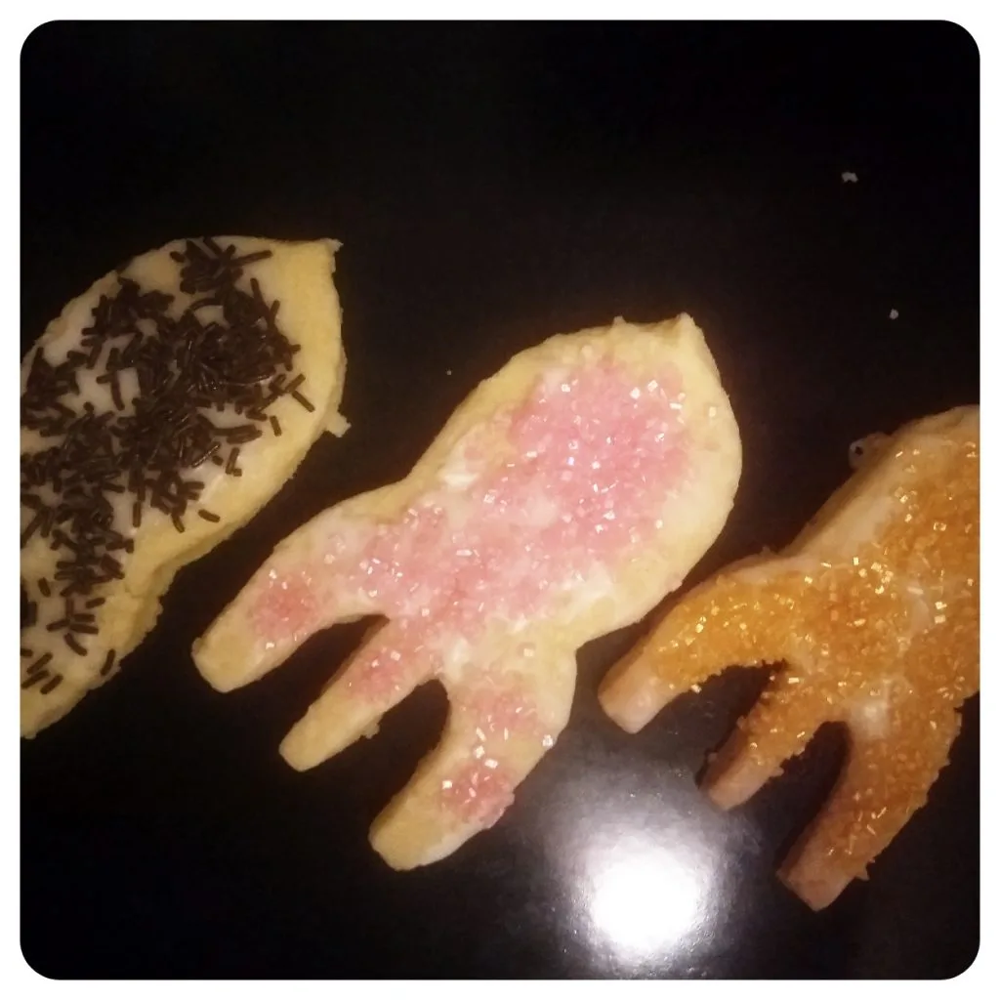
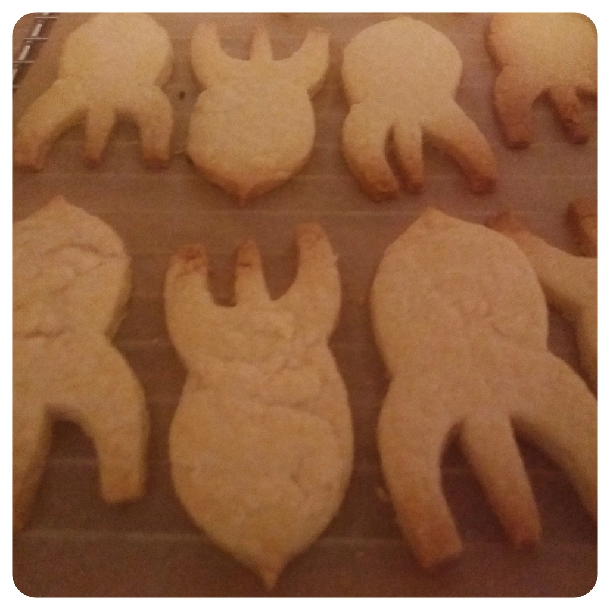

Wie jedes Jahr, habe auch dieses mal übertrieben und Unmengen an Keksen, Plätzchen und Cookies gebacken. Dank einen User auf Mastodon (\*wink\*) gab es dieses Jahr für jeden der mich ansprach, abfing, oder von mir angeboten, Fairydust Cookies. Da die Ausstechform, welche ich erhielt, relativ groß war, musste ich mehr Teig vorbereiten.

## Zutaten Teig:

- 500g Mehl Typ 405
- 340g Margarine
- 150g Zucker
- 24g Vanillezucker
- Vanillearoma
- 4 EL Wasser

## Zutaten Zuckerguss:

- 250g Puderzucker
- 2-3 EL Zitronensaft
- 5 EL Wasser

Gebt alle Zutaten in eine Schüssel und knetet, knetet und knetet. Rollt den Teig auf einer bemehlten Oberfläche zu einer dicke von 3mm aus. Heizt dabei schon mal den Ofen auf 180° Ober und Unterhitze vor. Nun könnt ihr die Fairydusts aus den Teig ausstechen. Falls ihr kein Raketen Ausstechform habt, geht natürlich jede andere Form ebenso gut. Legt die Kekse auf ein Blech, welches mit Backpapier ausgelegt ist und schiebt die Kekse für mindestens 15 Minuten in den Ofen, bzw. bis die Kekse eine angenehme dunkle Farbe erhalten. Während die Kekse abkühlen, können wir uns dem Zuckerguss widmen.

Nehmt hierfür ein hohes Behältnis und kippt die 250g Puderzucker hinein, gebt dazu 2-3 EL Zitronensaft und zum Schluss 5 EL Wasser. Vermischt das ganze bis es zu einen dicken Guss wird. Dann könnt ihr die Kekse mit dem Zuckerguss bestreichen und mit Streusel und Glitzer dekorieren.

Dann mal ein frohes hacken.
