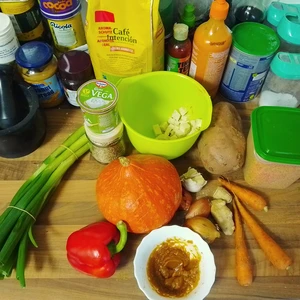
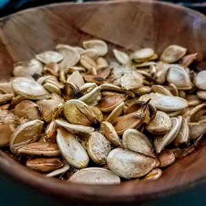
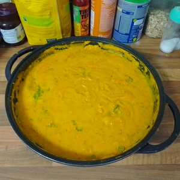

Auf dem Chaos Communication Camp hatte ich bereits eine vegane Süßkartoffel-Creme Suppe zubereitet, jedoch musste es auf dem Camp skalieren und konnte mich nicht mit Details beschäftigen.
Weil ich aber wieder eine Lust auf diese Suppe entwickelte, dachte ich mich mir, ich versuche solche Suppe neu zu denken.

<!-- more -->

# Zutaten
* 800 g Süßkartoffel
* 1 Kg Hokkaidokürbis
* 100 g rote und/oder gelbe Linsen
* 100 g Möhren
* 2 Zwiebel
* Halbe Knolle Knoblauch
* Ingwer
* [Honig](/articles/loewenzahn-sirup-2019-04-22/)
* 1 L [Hafermilch](/articles/hafermilch-2022-01-29/)
* 150 g vegane Crème fraîche 
* Chili
* 1 rote Paprika
* Kokosfett oder Pflanzenöl
* Lauchzwiebel
* Salz
* 1 EL Rosmarin

Die Süßkartoffel wird geschält und in grobe Würfel geschnitten. Da die Schalle des Hokkaidokürbis weich wird beim Kochen, behalten wir diese auf dem Fruchtfleisch und würfel auch diese. Die Kerne können zur Seite genommen und gewaschen sowie getrocknet werden. Diese ergeben in der Pfanne geröstet mit Salz und Pfeffer einen netten Snack. 

||
:---:

*Geröstete Kürbiskerne mit Salz und Pfeffer*

Auch die Paprika wird in grobe Würfel geschnitten. Die Zwiebel wird klein gehackt und die Möhren gerieben. Die Chili(s) werden einfach in Ringe geschnitten.
Die Linsen werden in kochenden Wasser gequollen, bis diese breiähnlich werden, die Süßkartoffel und den Kürbis kochen wir ebenfalls in Wasser, bis diese weich sind.

||
:---:

Erhitzt in einem tiefen Topf Öl oder Fett (macht nicht denselben Fehler wie ich und nutzt einen Wok) und reibt etwa ein Daumen Ingwer ins Fett, damit dieser als Geschmack einzieht. Bratet dann die Zwiebel darin ein, bis diese Farbe bekommen, gebt dann die Chili(s) hinzu. Sobald diese etwas dunkel werden, kommen die Möhren hinzu und werden mit etwas Honig begossen, damit alles karamellisiert. Dann können die Paprika Würfel dazu gegeben werden. Diese geben nun etwas Saft ab und zugleich werden diese durchs Anbraten weicher. Danach folgen die Linsen, welche wir zuvor in kochenden Wasser quellen ließen. Löscht das ganze mit der Hafermilch und gebt die Süßkartoffel und Kürbis hinzu. Den Knoblauch presst ihr zum Schluss hinzu. Würzt das ganze mit etwas Salz, verrührt alles ordentlich, Deckel darauf und lasst es für ca. 30 Minuten auf kleiner Flamme köcheln, vergesst jedoch nicht gelegentlich alles um zu rühren, damit nichts anbrät. Zum Schluss geben wir die Crème fraîche, gehackter Rosmarin und klein geschnittene Lauchzwiebel in den Topf, danach wird alles püriert. Alles lassen wir vor dem Servieren nochmals für einige Minuten kochen. Fertig ist die Suppe.

||
:---:

In meinen Fotos sind noch frittierte Tofubällchen, welche in einer Erdnussmarinade gezogen. Diese sind optional und können weggelassen werden.
  
