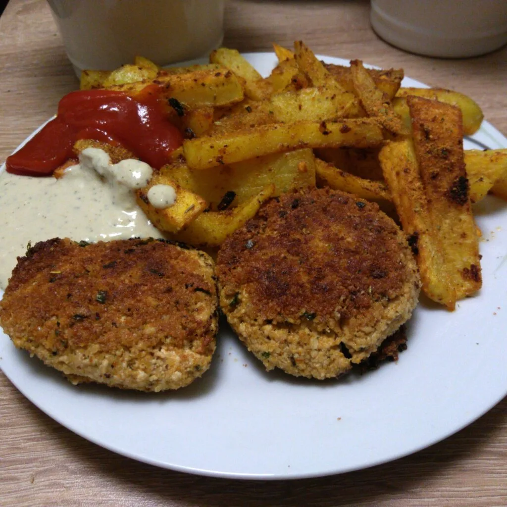
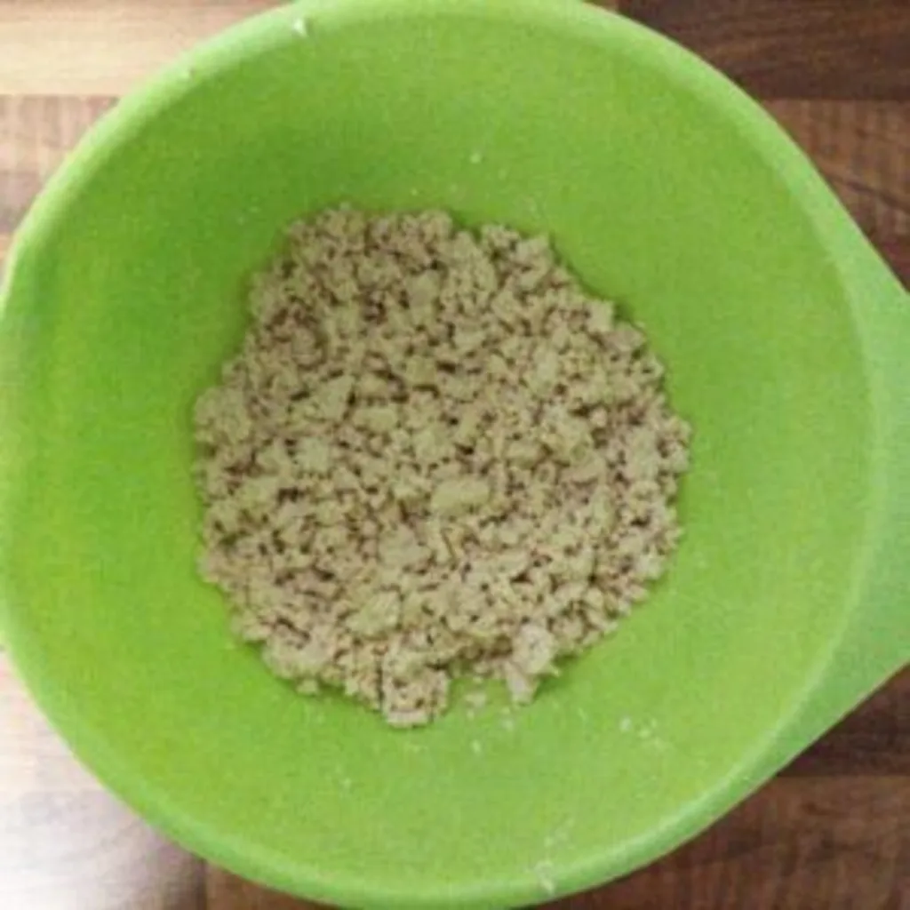
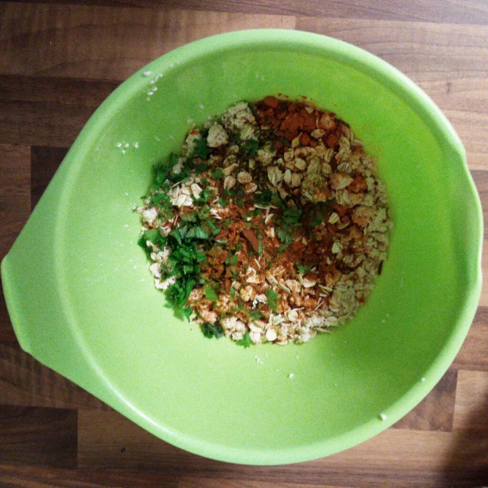
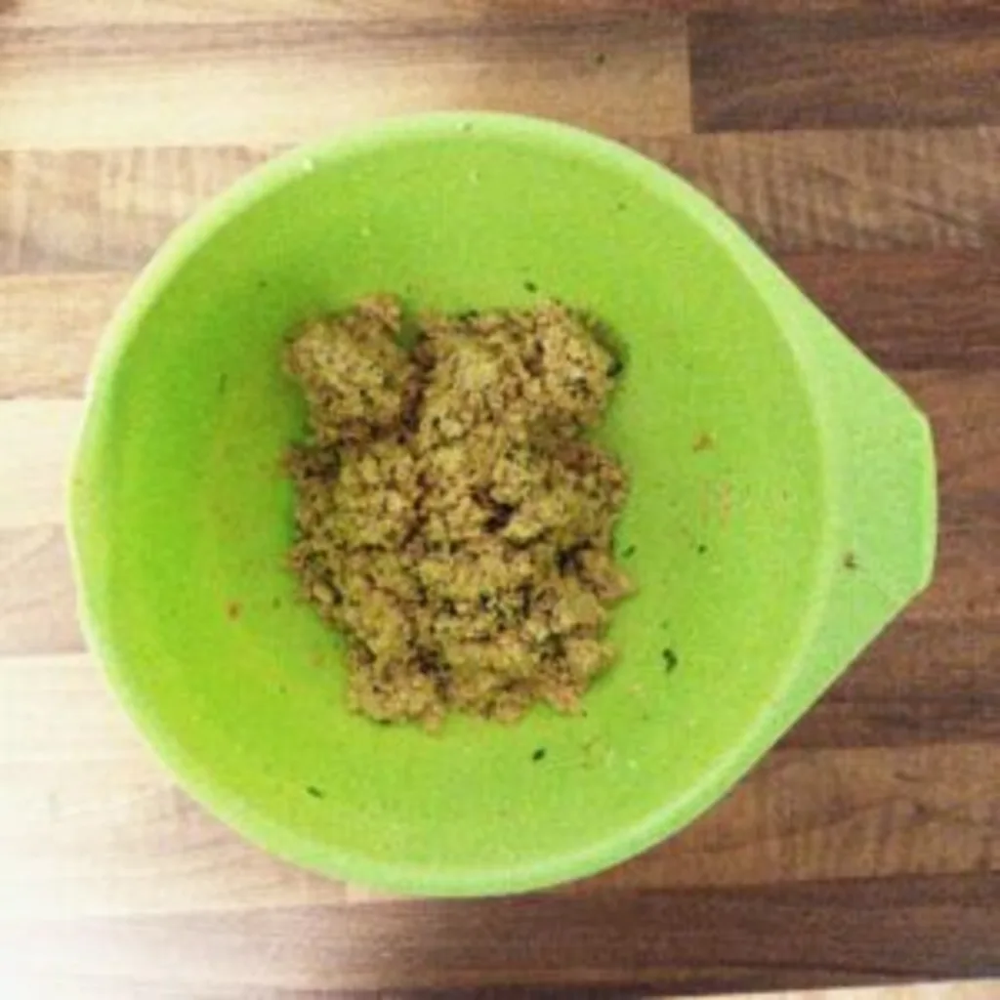
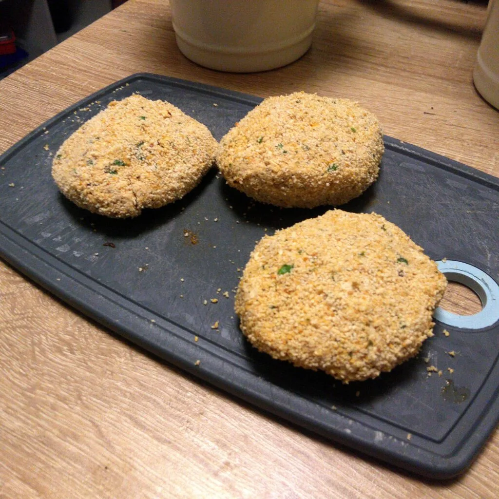

Letztens hatte ich bemerkt, das mein Tofu dringend verarbeitet werden musste, da das MHD kurz vor der Tür stand. Nur hatte ich keine Lust auf [Scrambled Tofu](articles/nudeln-mit-scrambled-tofu-2020-09-24) oder mir bekanntes. Also dachte ich mir, wenn ich es klein mache und paniere, dann kann doch was Brauchbares mit Kartoffeln als Beilage machen.

Hier einmal die Auflistung der Zutaten für 2-3 (je nach Größe) Frikadellen.

- 175g Tofu
- 1EL Haferflocken
- 1 Prise Salz
- Pfeffer nach Bedarf
- 1 EL Grillkräuter
- 1 EL Paprika
- 2 TL Eiersatz
- 1 EL Pflanzen Öl
- 2 CL Wasser

Den Tofu könnt ihr vorher marinieren oder einlegen, falls ihr einen bestimmen Grundgeschmack erreichen wollt. Zerrupft den Tofu in kleine Fetzen und gebt die Gewürze hinzu. Vermengt das ganze und gebt das Pflanzen Öl hinzu. Verknetet das ganze, so dass ihr die Haferflocken nicht mehr wahr nimmt. Hier ein Tipp von mir. Alles wird an euren Fingern kleben und abfärben. Eventuell nehmt ihr Handschuhe beim Arbeiten oder benutzt ein Küchengerät hierfür. Bei mir war dies reine Handarbeit. Ich habe frische Kräuter wie Petersilie für den Geschmack hinzugefügt.

||||
::|::|::
||

Nun gebt den Eiersatz dazu. Ich hatte 2 TL auf 2 CL benutzt, was ich in den Teig rein geknetet habe. Dadurch hielten die Frikadellen beim Verarbeiten Ihre Form und waren beim Verspeisen sehr fluffig. Vermischt alles ordentlich und lasst das ganze eine halbe bis zu einer Stunde stehen und ziehen. Danach lassen sich aus der Mischung Bälle formen, welche dann eingedrückt werden können. Diese paniert ihr die Tofu Frikadellen. Da die Mischung immer noch genug Feuchtigkeit besaß, habe ich hier auf Eiersatz verzichtet und die Tofu Frikadellen direkt im Paniermehl gewälzt.

Diese könnt ihr dann mit Pflanzen Öl oder Margarine in der Pfanne anbraten. Beim Wenden müsst ihr eventuell aufpassen, da die Frikadellen am Rande noch etwas weich sind und somit auseinander fallen könnten.

Die Frikadellen haben Super mit Pommes und einer ordentlich brennenden Knoblauchsoße zusammen gepasst. Ich war mit dem Ergebnis sehr zufrieden und versuche mich demnächst an einer scharfen Variante 🔥
