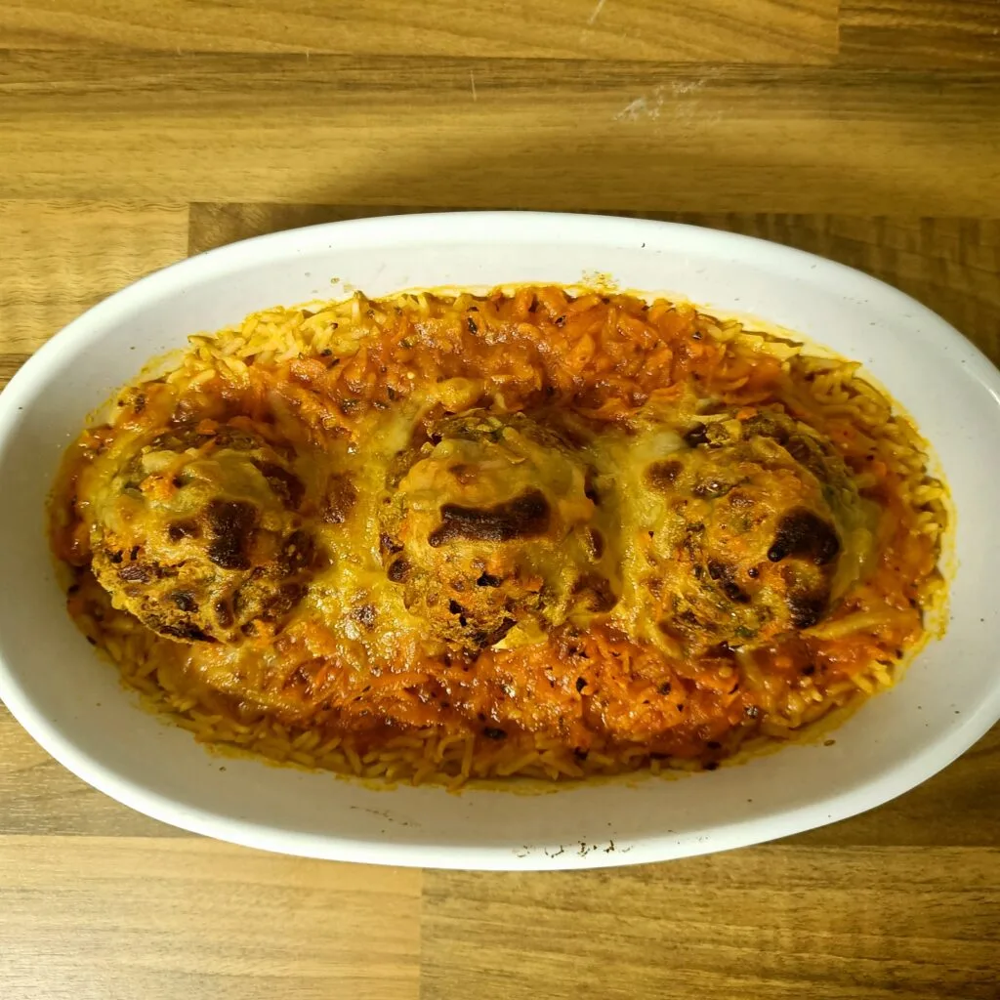
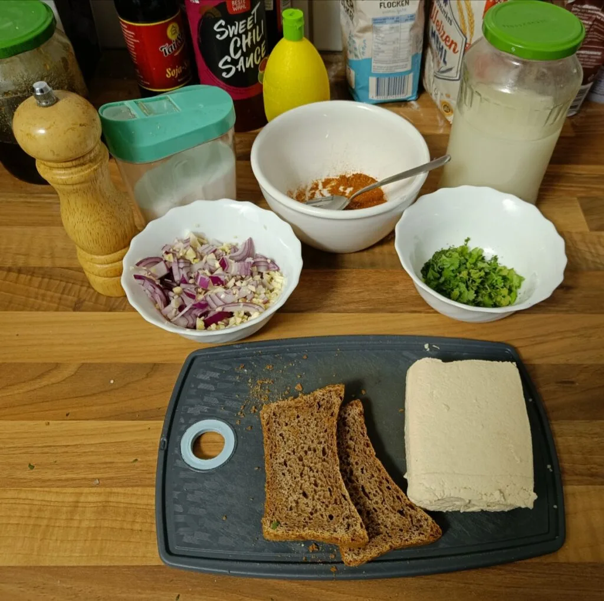
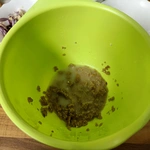
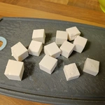
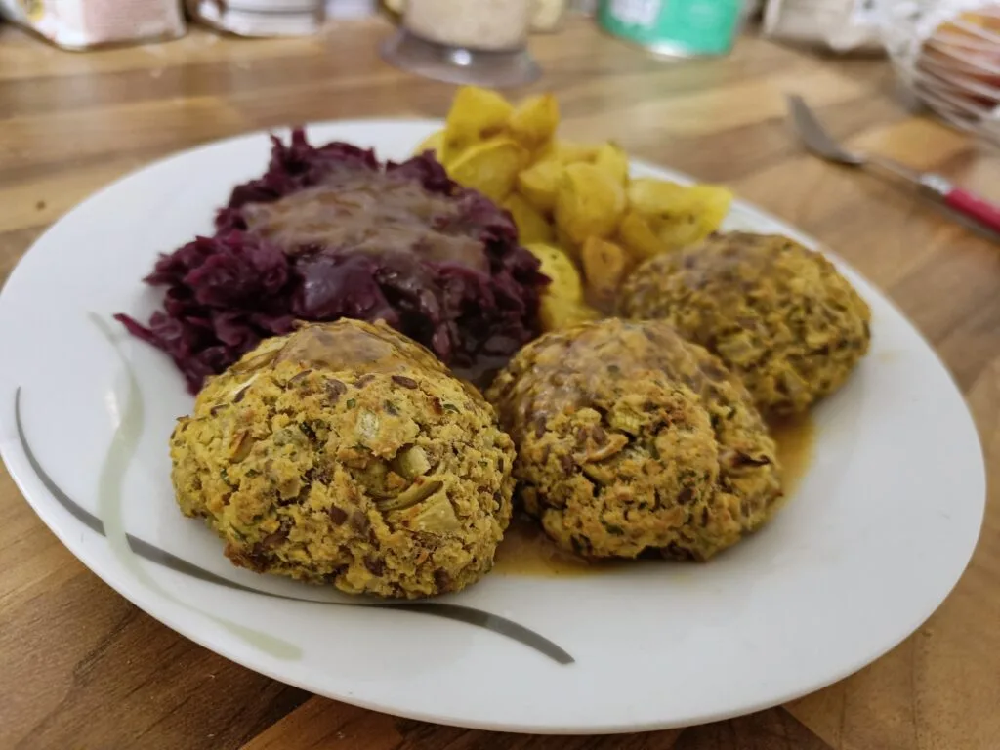

Ich habe hier bereits einmal über [Tofu Frikadellen](articles/tofu-frikadellen-2021-01-01) geschrieben. Dies ist eine Abwandlung, in welchen die Tofuletten, als Mischung aus Bouletten und Tofu, nicht in der Pfanne angebraten werden, sondern im Ofen vorbereitet werden. Vorweg muss erwähnt werden, dass die Tofuletten sehr luftig im inneren sind und damit beim Zerschneiden zart auseinander fallen. Bei diesem Rezept habe ich die Tofuletten einmal mit einer Füllung Feta Art und einmal ohne Füllung gemacht, die Basis bleibt jedoch dieselbe:

## Zutaten
für 6 Kugel

- 2 Scheiben Brot
- 175-200 g Tofu
- 1 Rote Zwiebel
- 2 Knoblauch Zehen
- 1 EL Petersilie
- 1 EL [Hafermilch](/articles/hafermilch-2022-01-29) 
- Leinsamen
- 3 EL Heißes Wasser
- Prise Salz
- Pfeffer
- 1 EL Paprikapulver
- Veganer Feta  

Das Brot wird klein gerupft und mit einem Schuss [Hafermilch](/articles/hafermilch-2022-01-29) eingeweicht. Sollte die Kruste hart sein, kann diese mit einer Reibe bearbeitet werden. Das Tofu kann nun eben so zerrupft und zum Brot hinzugegeben werden. Schlagt die Mischung mit einer Gabel.

|||
::|::
|

Nun muss in einem Mixer die Leinsamen zu Mehl verarbeitet werden, damit wir davon einen Esslöffel mit drei Esslöffel heißen Wasser vermischen und fünf Minuten ziehen lassen können, bevor wir es zum Tofu hinzugeben. Die Zwiebel wird gewürfelt und die Knoblauchzehen klein gehackt, diese kommen ebenso zum Tofu. Würzt das ganze mit Petersilie, Salz, Pfeffer und Paprikapulver.

||||
::|::|::
||

Nun verknetet die Mischung. Würfelt den veganen Feta und formt mit diesen und dem Tofu sechs Kugeln. Diese Kugeln kommen auf ein mit Backpapier belegtes Blech und für 40 Minuten in ein Ofen, welches wir auf 180 Grad vorgeheizt haben. Der Feta kann optional weggelassen werden.

Je nachdem ob wir die Tofuletten mit dem Feta zubereitet haben oder nicht, entscheidet wie wir die Tofuletten servieren. Ein Beispiel ist es mit Reis, Tomatensoße und mit Schmelz überbacken. Der Reis wird gekocht und in eine Auflaufform gegeben. Für die Tomatensoße habe ich Paprika, Tomaten und Möhren angebraten, mit Weißweinessig gelöscht und dann mit Wasser aufgekocht. Die Auflaufform war nur so lange im Ofen, bis der geriebene Schmelz schmolz.

|||
::|::
|

Alternativ können diese ohne dem Feta, mit Kartoffeln, Rotkohl und einer dunklen Soße serviert werden. Geschmacklich war ich zufrieden und auch, dass die Kruste die Buletten aus Tofu zusammen hielten. Diese sind auch sehr zart und luftig im inneren.

