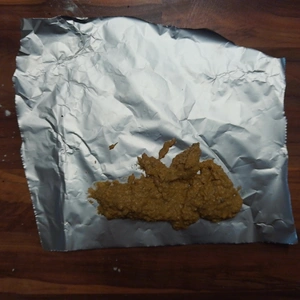
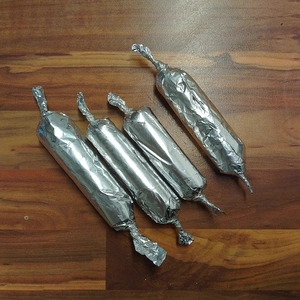
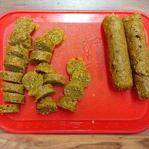
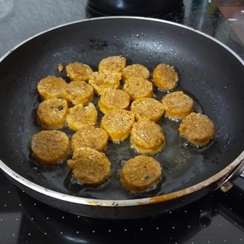

Einer meiner Experimente war es mal eine vegane Wurst herzustellen. Dabei habe ich mich mehr an osteuropäischer Wurst orientiert als die eher fade deutsche Wurst.
Deshalb sind viele Gewürze in meinem Rezept und diese Wurst muss nicht unbedingt als Currywurst zu bereitet werden, sondern kann auch anderweitig verarbeitet werden.

<!-- more -->

# Zutaten Wurst
* 100 g Haferflocken
* 100 g Mehl (nach Wahl)
* 1 Esslöffel Stärke
* 1 Teelöffel Kreuzkümmel
* 1 Teelöffel Knoblauchgranulat
* 1 Teelöffel Koriander
* 1 Teelöffel Salz
* 1 Teelöffel Pfeffer
* 1 Teelöffel Paprika
* 1 Teelöffel Dill
* 1 Teelöffel Bärlauch, Basilikum, Kerbel, Kresse, Petersilie, Schnittlauch
* 1 Teelöffel Gemüsebrühe
* 180ml Wasser

# Zutaten Curry Soße
* 1/2 Zwiebel (gerieben)
* Zucker zum karamellisieren
* 100 g Tomatenmark
* Sojasoße 
* Wasser
* 2 EL Kurkuma
* 1 EL schwarzer Pfeffer
* 1 EL Bockshornklee
* 1 EL Fenchelsamen
* 1 TL Kreuzkümmel
* 1 TL Koriander
* 1 TL Nelken
* 1 TL Salz
* Öl

Wir fangen bei der Zubereitung der Wurst an, da diese noch garen muss und währenddessen kann die Soße zubereitet werden.
Die Gewürze werden in einem Mörser zermahlen, bis wir ein Pulver erhalten. Ebenso zermahlen wir die Haferflocken zu Mehl im Mörser und vermischen diese mit dem Mehl, Stärke und der Gewürzmischung. Zum Schluss kommt das Wasser, im welchen wir die Gemüsebrühe aufgelöst haben, hinzu und verkneten das ganze zu einer Masse. 
Wir benötigen jetzt einen Topf mit kochendem Wasser. Einen ordentlichen Klecks des Teiges geben wir nun auf eine Alufolie, welche wir zusammen rollen und an den Enden verdrehen, sodass wir eine Wurst erhalten. Diese wiederholen wir, bis der Teig aufgebraucht ist und geben diese in den Topf mit dem kochendem Wasser. Die Würste bleiben darin, bis sich die Alufolie sich langsam verdunkelt, bzw. für ca. 30 Minuten.

||||
:---:|:---:|:---:
||

Während die Wurst im Wasser gart, kümmern wir uns um die Soße. 
Erneut zermahlen wir die Kräuter und Gewürze in einem Mörser und stellen unser Currypulver zur Seite. In einer Pfanne braten wir die geriebene Zwiebel an, bis diese Farbe erhält (ca. 5 Minuten) und geben etwas Zucker hinzu, damit wir das ganze karamellisieren. Danach kommt das Tomatenmark hinzu und löschen alles mit einem Schuss Sojasoße. Mit etwas Wasser gießen wir die Soße auf und verrühren das Tomatenmark, sodass es eine dicke Soße wird. Diese lassen wir auf kleiner Flamme köcheln.

Die Wurst kann aus dem Topf heraus genommen und aus der Alufolie befreit werden. Lass die Wurst abkühlen und schneidet sie danach in Scheiben. Jetzt könnt ihr diese zum Beispiel anbraten, die Soße darüber streuen und das Currypulver darüber streuen. Dazu passen selbstverständlich Pommes.

  
