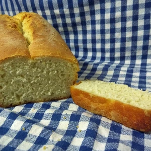
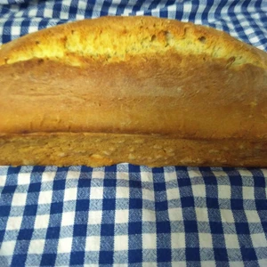

Solltet einmal kein Brot zu Hause vorhanden sein und es muss mal einfach gehen, kann auf ein Weißbrot gebacken werden.
Es werden nicht viele Zutaten benötigt und ist in etwa zwei Stunden fertig gebacken.

<!-- more -->

# Zutaten
* 375g Weizen Mehl (Type 550)
* 250ml lauwarmes Wasser
* 7g Trockenhefe
* 1 EL Margarine
* 1 TL Salz
* 1 TL Zucker
* 1 EL [Honigersatz](/articles/loewenzahn-sirup-2019-04-22/)

Die Trockenhefe wird im lauwarmen Wasser mit dem Honigersatz aufgelöst und für einige Minuten stehen gelassen. Währenddessen wird das Mehl mit Salz und Zucker vermengt. Die Margarine wird auf kleiner Flamme erwärmt, sodass diese schmilzt und zum Mehl hinzugegeben. Beginnt den Teig zu verkenten und gießt das Wasser mit der Hefe langsam hinzu. Zum Schluss bemehlt den Rand der Schüssel und lasst diese für zwanzig Minuten an einem warmen Ort gehen.

Knetet den Teig nach den zwanzig Minuten erneut durch und gebt diesen in eine gefettete Kastenform. Der Teig ruht nun weitere 45 Minuten.

Im letzten Schritt wird die Teigoberfläche längst eingeschnitten und mit Wasser bestrichen. Der Backofen wird auf 225 Grad Ober- und Unterhitze vorgeheizt. Das Brot wird danach für 40 Minuten gebacken. 
Holt das Weißbrot heraus, stürzt es und lasst das Brot abkühlen.

||||
:---:|:---:|:---:
||

