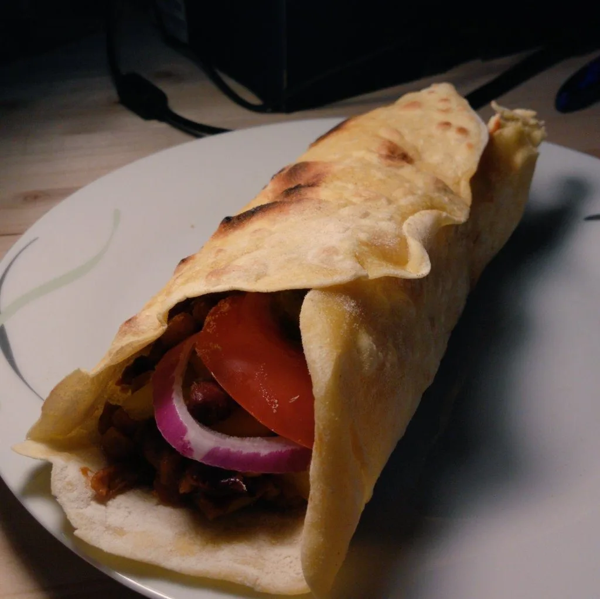
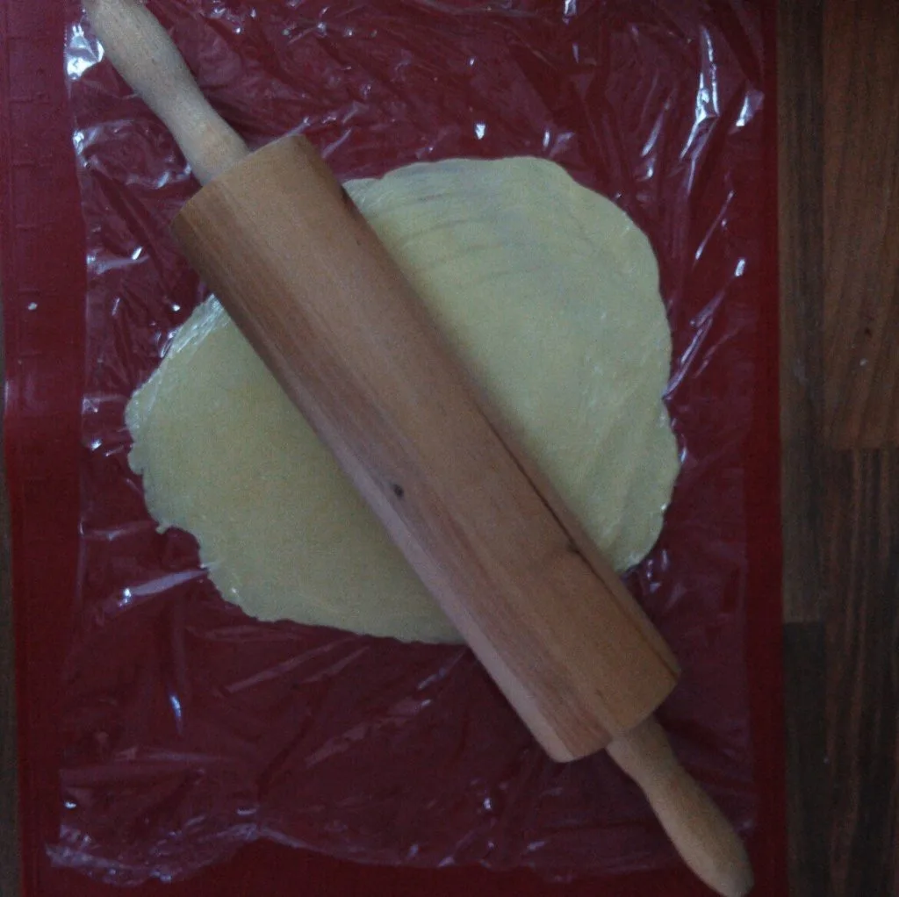
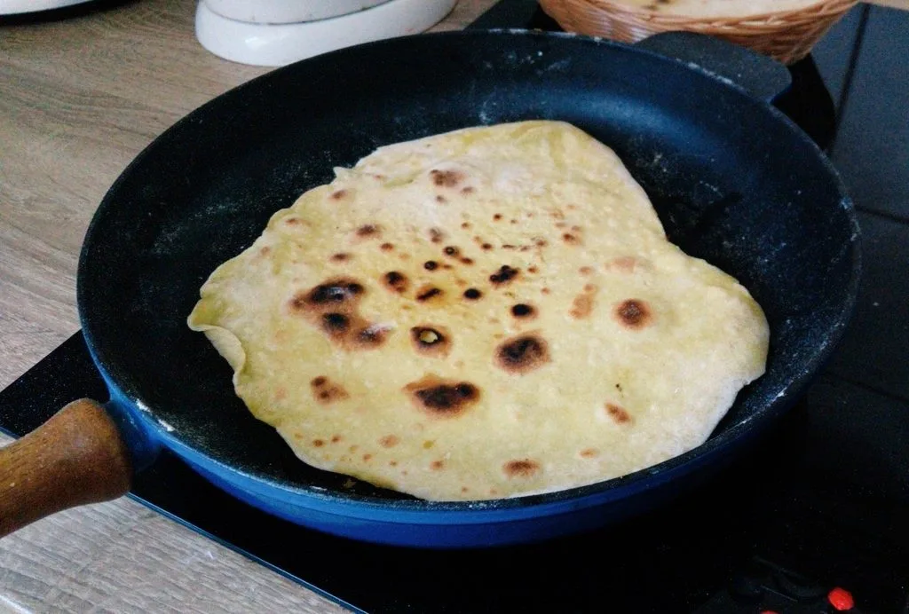
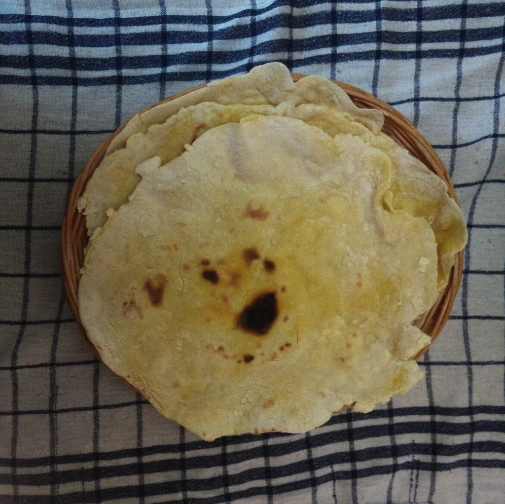

Einer meiner favorisierten Speisen sind Wraps, da man diese leicht, variabel und schnell zusammen rollen kann. Was mich nervt, ist der Verpackungsmüll und die Lagerung. Da der Supermarkt durch die Pandemie mehr alternative Mehlsorten aufgenommen hat, gibt's jetzt auch Maismehl, was mich dazu veranlasste mal eigene Wraps zu machen.

## Zutaten

- 140 g Mehl (Typ 405)
- 80 g Mais Mehl
- 120 ml lauwarmes Wasser
- ½ TL Salz

(Das Rezept reicht für vier Wraps)  
Gebt beide Mehl Sorten und das Salz in eine Schüssel unvermischt die Zutaten. Nun kippt ihr langsam das Wasser in die Schüssel und verkneten den Teig zu einer Kugel, sodass nichts mehr an kleben bleibt.

Zupft ein Stück vom Teig ab und rollt diesen auf einer bemehlten Oberfläche dünn aus. Der Wrap sollte nicht größer sein als die Pfanne die benutzt wird.

Erhitzt eine schwere Pfanne auf mittlere Stufe (ich habe eine Gusseiserne genommen). Sobald die Pfanne heiß ist, kann der ausgerollte Teig in die Pfanne gelegt werden. Wartet, bis sich der Rand vom Wrap wölbt. Dann wendet ihr den Wrap und wartet erneut, bis der Rand sich wölbt. In wenigen Minuten ist der Wrap somit fertig.

Deckt die fertigen Wraps mit einem Küchentuch ab und lasst diese leicht abkühlen.

Danach könnt ihr die Wraps nach Herzenslust belegen und verzerren.

